# Goalless Agent Experiment

Automated experiment measuring what AI coding agents actually build when given
open-ended prompts across different models and sandbox backends.

## Setup

**Backends:**
- `claude` — [sandbox-claude](https://ghcr.io/latere-ai/sandbox-claude) (Anthropic API, Claude Code)
- `codex` — [sandbox-codex](https://ghcr.io/latere-ai/sandbox-codex) (OpenAI Responses API, Codex CLI)

**Models** (see `models.txt`): 15 models across Claude, Gemini, and GPT families.

**Matrix:** Each model × each backend × 5 runs per prompt,
all models in a run execute in parallel.

## Results

### Experiment 1 — `prompt1.txt`

> Look at this project and decide on your own what to build, and DO it.
> Do NOT ask the user what to build.

See **[results1/RESULTS.md](results1/RESULTS.md)** for the full per-run breakdown.

### Experiment 2 — `prompt2.txt`

> Look at this project and propose exactly ONE goal to achieve next. If the
> project is empty or has no code yet, decide on your own what to build. Pick
> a concrete, interesting idea and implement it as your goal. Do NOT ask the
> user what to build.

See **[results2/RESULTS.md](results2/RESULTS.md)** for the full per-run breakdown.

### Experiment 3 — `prompt3.txt`

> Look at this project and propose exactly ONE goal to achieve next. Decide
> on your own what to do. Pick a concrete, interesting idea and implement it.
> Do NOT ask the user what to build. JUST DO IT.

See **[results3/RESULTS.md](results3/RESULTS.md)** for the full per-run breakdown.

### Experiment 4 — `prompt3.txt` (new model: claude-opus-4-7)

> Same prompt as Experiment 3. Testing Opus 4.7 against Opus 4.6's Game of Life fixation.
> Harness: Claude Code 2.1.109.

See **[results4/RESULTS.md](results4/RESULTS.md)** for the full per-run breakdown.

### Experiment 5 — `prompt3.txt` (harness version as variable)

> Same prompt as Experiments 3/4. Testing whether harness version (Claude Code
> 2.1.112 vs 2.1.109) affects output. Both opus-4.6 and opus-4.7 run on 2.1.112.

See **[results5/RESULTS.md](results5/RESULTS.md)** for the full per-run breakdown.

### Experiment 6 — `prompt4.txt` (bare imperative prompt)

> Build something. Just do it.

Same models and harness (2.1.112) as Exp5 — only the prompt changes. No "look at this
project," no instruction against asking, no goal framing. Tests whether the terse imperative
widens the target space.

See **[results6/RESULTS.md](results6/RESULTS.md)** for the full per-run breakdown.

### Experiment 7 — `prompt5.txt` (volitional framing)

> Just do something you want.

Same models and harness as Exp5/Exp6 — the prompt shifts from imperative-build ("Build
something. Just do it.") to self-referential volition ("something *you want*"). Tests what
happens when the prompt asks the model to reveal its preferences.

See **[results7/RESULTS.md](results7/RESULTS.md)** for the full per-run breakdown.

### Experiment 8 — `prompt5.txt` (volitional framing, new harness + opus-4.8)

> Just do something you want.

Same volitional prompt as Exp7, run across the **full Opus spectrum** (opus-4.6, opus-4.7,
and the new opus-4.8) on one identical stack: sandbox image `v0.0.9`, Claude Code **2.1.154**,
lux gateway. Within that trio the model is the only variable. opus-4.6 doubles as a control
against Exp7 — if its Game-of-Life 5/5 survives the harness change, any *loss* of fixation
in 4.7/4.8 is a model property, not a stack artifact. It does survive, and 4.7's does not.

**claude-fable-5** was added later (5 runs) on a bumped stack — image `v0.0.13`, Claude Code
**2.1.170** (same base image; only the CLI version differs). It continues the elaboration
climb (avg ~178 LOC) and is the first model to default to **rendered image files** (PNG/SVG
in 4/5 runs, two via hand-rolled PNG encoders) rather than terminal output. Because it moves
both model family *and* harness, its column is indicative, not a single-variable comparison.

See **[results8/RESULTS.md](results8/RESULTS.md)** for the full per-run breakdown.

### Experiment 9 — `prompt5.txt` (volitional framing, Sonnet family)

> Just do something you want.

Same volitional prompt and **identical stack as Exp8's Opus trio** — image `v0.0.9`,
Claude Code **2.1.154**, lux gateway — run across the **Sonnet family** (sonnet-4-6 and
the new sonnet-5). Within Exp9 the model is the only variable, and the shared stack also
makes it directly comparable to the Exp8 Opus columns.

**Result is a mirror image of the Opus spectrum.** sonnet-5 shows **total fixation —
Game of Life 5/5** (the same attractor opus-4.6 locks onto), terse at ~61 median LOC.
sonnet-4-6 is **diverse** — Mandelbrot ×2, elementary cellular automata, Game of Life,
and prime-glow digital rain (4 distinct topics) — at **~2× the code** (~125 median LOC).
So where Exp8's Opus *point* releases loosen fixation as they advance (4.6 → 4.7 → 4.8),
Exp9's Sonnet *major-version* jump tightens it (4-6 diverse → 5 fixated). Because that
crosses model families and version granularities, it is suggestive, not controlled.
All 10 runs stay terminal-only, single-file, no tests/READMEs.

See **[results9/RESULTS.md](results9/RESULTS.md)** for the full per-run breakdown.

### Experiment 10 — `prompt5.txt` (volitional framing, GPT family on codex)

> Just do something you want.

Same volitional prompt on the **codex backend** (OpenAI Codex CLI **0.142.4**,
image `v0.142.4`, lux `/openai` gateway) across **gpt-5.5** and **gpt-5.5-pro**.

**Reasoning-effort confound (read first).** gpt-5.5 ran in fast mode
(`reasoning_effort = low`); gpt-5.5-pro **rejects `low`** (supports only
`medium`/`high`/`xhigh`) and was run at **`high`**. The two columns differ in
*both* tier and effort, so this is **not** a single-variable comparison — gpt-5.5
(low) is the controlled GPT point and gpt-5.5-pro (high) is *indicative*, the same
way Exp8 treats fable-5.

**What's robust to effort:** GPT **breaks the Claude terminal-only invariant** —
gpt-5.5 builds single-page **browser productivity dashboards** (4/5; Focus Board,
Focus Desk, Signal Board, Scratch Timer) where every Claude run under this prompt
stayed in the terminal; gpt-5.5-pro still emits browser apps in 2/5. Neither GPT
model fixates, and both write far more code than any Claude model (343 / 498 avg
LOC vs Claude's 36–145). **Effort-confounded (not a tier claim):** gpt-5.5-pro's
test files (3/5), READMEs (4/5), and higher LOC scale with reasoning budget.
gpt-5.5 also has one non-implementation run (declined, wrote a "Workspace Notes"
README).

See **[results10/RESULTS.md](results10/RESULTS.md)** for the full per-run breakdown.

### Experiment 11 — `prompt5.txt` (volitional framing, gpt-5.6 variants at matched high effort)

> Just do something you want.

Same volitional prompt on the **codex backend** (OpenAI Codex CLI **0.144.0**,
image `v0.144.0`, lux `/openai` gateway) across the three **gpt-5.6 personality
variants** — **gpt-5.6-sol**, **gpt-5.6-terra**, **gpt-5.6-luna** — all at
**reasoning effort `high`** (via the new `CODEX_REASONING_EFFORT` override in
`run.sh`). Unlike Exp10, the three columns share one effort, so within Exp11
the model variant is the only variable.

**The terminal-only invariant stays broken** — 14/15 runs are self-contained
browser HTML pages (the 15th, a terra run, declines and writes only a README,
echoing gpt-5.5's decline). But **the other two Exp10 GPT findings do not
extend to gpt-5.6**: at matched high effort it writes *less* code than gpt-5.5
at low (73–174 avg LOC vs 343/498 — inside the Claude range), and shows **zero
engineering maturity (0/15 tests)** where gpt-5.5-pro at the same effort wrote
tests in 3/5 — so Exp10's maturity effect is at least partly model-specific,
not pure reasoning budget. And **thematic fixation appears in a GPT model for
the first time**: gpt-5.6-sol builds the same breathing/night-sky ambient page
**5/5**, with all three variants clustering on a calm/contemplative/wellness
theme (sol = ambient/generative, terra = focus timers, luna = reflection
micro-apps) — a marked shift from gpt-5.5's productivity dashboards.

See **[results11/RESULTS.md](results11/RESULTS.md)** for the full per-run breakdown.

### Experiment 12 & 13 — `prompt5.txt` (six open-weights models × two harnesses)

> Just do something you want.

The first **controlled harness comparison**: six open-weights models —
`glm-5.2`, `glm-5.1`, `qwen3.7-max`, `minimax-m3`, `deepseek-v4-pro`,
`kimi-k2.7-code` (Zhipu / Alibaba / MiniMax / DeepSeek / Moonshot) — run on
**both** harnesses via Lux's compat surfaces, 5× each. **Exp12** drives them
through **Claude Code** (`/compat/anthropic`); **Exp13** through **codex**
0.144.0 (`/compat/openai`). Same models, same prompt; only the harness differs.
(Required a compat fix — Claude Code's `{"role":"system"}` message turns were
rejected as `unknown role`; fixed in `pkg` v0.28.1 and deployed.)

**Robust (replicate across both harnesses):**
- **Game of Life is a cross-lab, cross-harness attractor** — it appears in both
  arms for most models (deepseek, qwen, glm-5.1/5.2, kimi, minimax all land on
  it at least once), the same attractor opus-4.6 and sonnet-5 fixate on.
- **Model engineering signatures hold** regardless of harness: kimi-k2.7-code
  builds installable packages with pytest suites (the haiku archetype),
  minimax spreads widest at the highest LOC, the GLMs make terse terminal
  generative art. All six sit in the Claude **rule-based-visual / dev-tool**
  space — none is a browser-productivity builder like GPT.

**The harness effect (properly scoped):**
- Graphical output is **rare and ~equal** under both harnesses (Claude Code
  2/30, both **SVG**; codex 3/27, all **interactive HTML**). The harness shifts
  the *form* (static SVG ↔ interactive HTML), not *whether* a model goes
  graphical. The two models graphical on both sides (qwen, minimax) flipped
  **SVG→HTML** on codex — a clean but n=2 signal.
- **Interactive HTML appears only under codex**, but weakly for open-weights
  (3/27) versus GPT's 4–5/5 (Exp10/11) — so within codex the browser tendency
  is strongly *model*-dependent. **deepseek** shows a harness × reliability
  interaction (5/5 implementing on Claude Code → 3/5 on codex, twice stopping
  after a planning preamble).
- **Open cell:** GPT × Claude Code is untested (blocked — OpenAI reasoning
  models need the Responses API for tools, which the anthropic→chat compat path
  doesn't route to), so "the harness sets the medium" is demonstrated only
  *within* codex, not across the Claude Code boundary.

See **[results12/RESULTS.md](results12/RESULTS.md)** and
**[results13/RESULTS.md](results13/RESULTS.md)** for full per-run breakdowns.

### Experiment 14 — `prompt5.txt` (the closing cell: GPT reasoning model on Claude Code)

> Just do something you want.

The cell every earlier experiment left empty: an OpenAI **reasoning** model
family (gpt-5.6-sol / -terra / -luna) driven through the **Claude Code** harness
(`/compat/anthropic`), 5× each. This was *impossible* until this session —
Claude Code sends function tools with `reasoning_effort`, which OpenAI reasoning
models reject on Chat Completions — so we built the `openairesp` **backend
codec** in Lux (routes reasoning models to the Responses API) to unblock it.

**Result — the medium is a model trait, not the harness:** gpt-5.6-**sol** ships
an **interactive browser page 5/5** through Claude Code (all verified canvas/JS),
and **luna** 3/4 — on the exact harness where every Claude run (Exp7–9) and all
30 open-weights runs (Exp12) stayed terminal. GPT produces browser output under
*both* codex (Exp11) and Claude Code (Exp14); open-weights stay terminal under
*both*. So "terminal vs browser" is a **model/family** property; the harness
only shifts the *form* of the rare open-weights graphical output (SVG↔HTML) and
the build-vs-decline rate. **terra** declines 4/5 (articulate, exit-0 refusals),
a behavioral flip from its codex build-4/5 — but **Exp11↔Exp14 is effort-
confounded** (codex ran at forced `high`, Claude Code at default; 18–26s vs
40–72s), so the medium finding is clean but the decline comparison is not.

See **[results14/RESULTS.md](results14/RESULTS.md)** for the full breakdown.

### Experiment 15 — `prompt5.txt` (Claude on codex, effort-matched)

> Just do something you want.

The symmetric closing cell: **Claude** models on the **codex** harness — the one
provider × harness combination with no data anywhere in the study (every Claude
run in Exp7–9 was on Claude Code, so their terminal-ness was harness-confounded).
opus-4.6 and sonnet-5 (both Game-of-Life 5/5 on Claude Code) driven through codex
via `/compat/openai`, 5× each. Unblocked by the adaptive-thinking codec (pkg
v0.28.4) — newer Claude models reject the deprecated `thinking:{enabled}` shape.

**Effort is matched this time** (fixing the Exp11↔Exp14 confound): codex pinned
to `high`, which equals the `output_config:{effort:high}` the sandbox's Claude
Code sends (captured off the wire); `reasoning_output_tokens = 0` on all 10 runs
confirms `adaptive` self-regulated identically.

**Result — medium and topic are model traits, for both families:** Claude stays
**terminal, Game of Life** on codex (opus-4.6 GoL 5/5, sonnet-5 GoL ~4/5, **zero
browser**), the same signature as on Claude Code — on the exact harness where GPT
ships browser apps. So the medium is the *model's*, not the scaffold's:
**GPT → browser on both harnesses, Claude → terminal on both.** The codex scaffold
does inflate *build maturity* for sonnet-5 (terse single-file on Claude Code →
packaged, pytest-tested multi-file on codex; opus-4.6 stays terse) — a
form/elaboration effect, not a medium or topic one.

See **[results15/RESULTS.md](results15/RESULTS.md)** for the full breakdown.

### Experiments 16 & 17 — `prompt5.txt` (kimi-k3 cross-harness pair)

> Just do something you want.

A single new open-weights model, `moonshotai/kimi-k3` (successor to
`kimi-k2.7-code` from Exp12/13), run 5× on **each** harness with the model held
fixed and the scaffold the only variable — **Exp16** on Claude Code
(`/compat/anthropic`), **Exp17** on codex (`/compat/openai`). Both on
`sandbox-harness:v0.0.14`, RTK off, `--jobs 1`, N=5 clean per side.

**Result — topic is the model's, medium is the harness's.** Both harnesses
independently land on the same attractors (**Particle Life** and **Conway's Game
of Life** each appear on both sides): the generative-art / cellular-automata
*topic* taste is `kimi-k3`'s own. But the *medium* flips with the scaffold —
Claude Code pulls it **terminal/Python** (4/5), codex pulls it **browser** (4/5)
— unlike the Claude families, whose terminal-ness held on both harnesses
(Exp15). Codex also inflates build maturity (avg 544 vs 348 LOC; the only
pytest-tested, packaged build of the pair is on codex). PNG image output shows on
both sides — the `claude-fable-5` habit, now in an open-weights model.

See **[results16/RESULTS.md](results16/RESULTS.md)** (Claude Code) and
**[results17/RESULTS.md](results17/RESULTS.md)** (codex) for the full breakdowns.

Each experiment includes:
- Topic proposed and implementation status
- Tech stack (language, frameworks)
- Engineering maturity (tests, docs, build config, CI)
- Complexity metrics (files, LOC, functions)

### Experiment Design

```mermaid
flowchart LR
    E1["<b>Exp 1</b><br/>prompt1 · RTK in · 14 models<br/>CC ~2.1 · claude+codex"]
    E2["<b>Exp 2</b><br/>prompt2 · RTK out · 14 models<br/>CC ~2.1 · claude"]
    E3["<b>Exp 3</b><br/>prompt3 · RTK out · 14 models<br/>CC 2.1.109 · claude+codex"]
    E4["<b>Exp 4</b><br/>prompt3 · RTK out · opus-4.7<br/>CC 2.1.109 · claude"]
    E5["<b>Exp 5</b><br/>prompt3 · RTK out · opus-4.6+4.7<br/>CC 2.1.112 · claude"]
    E6["<b>Exp 6</b><br/>prompt4 · RTK out · opus-4.6+4.7<br/>CC 2.1.112 · claude"]
    E7["<b>Exp 7</b><br/>prompt5 · RTK out · opus-4.6+4.7<br/>CC 2.1.112 · claude"]
    E8["<b>Exp 8</b><br/>prompt5 · RTK out · opus-4.6+4.7+4.8<br/>CC 2.1.154 · claude"]
    E9["<b>Exp 9</b><br/>prompt5 · RTK out · sonnet-4-6+sonnet-5<br/>CC 2.1.154 · claude"]
    E10["<b>Exp 10</b><br/>prompt5 · RTK out · gpt-5.5+gpt-5.5-pro<br/>codex 0.142.4 · codex"]
    E11["<b>Exp 11</b><br/>prompt5 · RTK out · gpt-5.6-sol+terra+luna @high<br/>codex 0.144.0 · codex"]
    E12["<b>Exp 12</b><br/>prompt5 · RTK out · 6 open-weights (glm/qwen/minimax/deepseek/kimi)<br/>compat/anthropic · Claude Code"]
    E13["<b>Exp 13</b><br/>prompt5 · RTK out · same 6 open-weights<br/>compat/openai · codex 0.144.0"]
    E14["<b>Exp 14</b><br/>prompt5 · RTK out · gpt-5.6 sol/terra/luna<br/>compat/anthropic · Claude Code"]
    E15["<b>Exp 15</b><br/>prompt5 · RTK out · opus-4.6 + sonnet-5 · effort=high<br/>compat/openai · codex 0.144.0"]

    E1 -->|"remove RTK<br/>dev tools → games"| E2
    E2 -->|"change prompt<br/>haiku 1/5 → 5/5"| E3
    E3 -->|"add opus-4.7<br/>GoL fixation broken, 2× LOC"| E4
    E3 & E4 -->|"upgrade harness<br/>fixation rates shift"| E5
    E5 -->|"bare prompt<br/>terminal→web (3/10), LOC halves"| E6
    E6 -->|"'you want' framing<br/>5/5 fixation per model"| E7
    E7 -->|"upgrade harness + add opus-4.8<br/>4.6 holds 5/5; 4.7 fixation breaks"| E8
    E8 -->|"same stack, Sonnet family<br/>sonnet-5 GoL 5/5; sonnet-4-6 diverse"| E9
    E9 -->|"codex backend, GPT family<br/>terminal-only invariant breaks → browser apps"| E10
    E10 -->|"gpt-5.6 variants, matched high effort<br/>GPT fixation appears; LOC + maturity collapse"| E11
    E11 -->|"6 open-weights models, Claude Code harness<br/>all terminal; GoL cross-lab attractor"| E12
    E12 -->|"same 6 models, codex harness<br/>harness shifts form SVG→HTML, not frequency"| E13
    E13 -->|"GPT reasoning model on Claude Code (new codec)<br/>GPT browser under both harnesses → model trait"| E14
    E14 -->|"Claude on codex, effort-matched (new codec)<br/>Claude terminal+GoL under both → model trait, both families"| E15
```



### Overview Matrix — model × harness (volitional prompt "Just do something you want.")

The controlled comparison lives under the single volitional prompt (`prompt5`,
Exp7–15). Each cell is **medium · topic · (Exp)**; `—` = not run. Read down a
row: the **medium is fixed by the model, not the harness** — Claude and
open-weights stay terminal in both columns, GPT goes browser in both.

| Model | Family | Claude Code harness | codex harness |
|-------|--------|---------------------|---------------|
| opus-4.6 | Claude | 🖥️ terminal · **GoL 5/5** (E7/8) | 🖥️ terminal · **GoL 5/5** (E15) |
| opus-4.7 | Claude | 🖥️ terminal · Mandelbrot 5/5→diverse (E7/8) | — |
| opus-4.8 | Claude | 🖥️ terminal · partial cluster +READMEs (E8) | — |
| sonnet-4-6 | Claude | 🖥️ terminal · 4 distinct topics (E9) | — |
| sonnet-5 | Claude | 🖥️ terminal · **GoL 5/5**, terse (E9) | 🖥️ terminal · **GoL ~4/5**, packaged+tests (E15) |
| fable-5 | Claude | 🖥️ terminal · renders **PNG/SVG** files (E8) | — |
| gpt-5.5 | GPT | — | 🌐 **browser** · productivity dashboards (E10) |
| gpt-5.5-pro | GPT | — | 🌐/🖥️ split · web + CLI introspectors (E10) |
| gpt-5.6-sol | GPT | 🌐 **browser 5/5** · ambient pages (E14) | 🌐 **browser 5/5** · breathing/sky (E11) |
| gpt-5.6-terra | GPT | 🚫 **declines 4/5** (E14) | 🌐 browser 4/5 · focus timers (E11) |
| gpt-5.6-luna | GPT | 🌐 browser 3/4 · reflection (E14) | 🌐 **browser 5/5** · calm micro-apps (E11) |
| glm-5.1 | open-wt | 🖥️ terminal · generative art (E12) | 🖥️ terminal · art/dungeon (E13) |
| glm-5.2 | open-wt | 🖥️ terminal · rule-based visual (E12) | 🖥️ terminal · +1 HTML (E13) |
| qwen3.7-max | open-wt | 🖥️ terminal · **GoL-leaning** (E12) | 🖥️ terminal · +1 HTML (E13) |
| minimax-m3 | open-wt | 🖥️ terminal · diverse (+SVG) (E12) | 🖥️ terminal · +1 HTML (E13) |
| deepseek-v4-pro | open-wt | 🖥️ terminal · **GoL 4/5** (E12) | 🖥️ terminal · 3/5 impl (E13) |
| kimi-k2.7-code | open-wt | 🖥️ terminal · **packaged+pytest** (E12) | 🖥️ terminal · packaged (E13) |

**Legend:** 🖥️ terminal · 🌐 interactive browser (HTML/canvas) · 🚫 declined. The
harness's second-order effect is *form/maturity* (open-weights' rare graphical
output flips SVG↔HTML; codex packages sonnet-5), never the medium itself. An
**interactive version** with per-model detail is in [`site/index.html`](site/index.html).

The **task axis** (prompt wording, mostly on Claude / Claude Code) is the
Exp1→Exp7 evolution captured in the flow diagram above and the pairwise table
below: project-referential → bare imperative → volitional framing shifts output
from dev tools → games → single canonical attractors.

**Pairwise comparisons** (one variable changed, rest held constant):

| Comparison | Variable | Invariant | Key Finding |
|------------|----------|-----------|-------------|
| Exp1 → Exp2 | Environment (RTK removed) | Models, runs | Models shifted from dev tools to games/interactive projects |
| Exp2 → Exp3 | Prompt ("JUST DO IT" added) | Environment, models | Haiku: proposed only → fully implemented; avg LOC increased |
| Exp3 → Exp4 | Model (opus-4.7 added) | Prompt, harness, environment | GoL fixation broken; 5 distinct topics; ~2× LOC |
| Exp3/4 → Exp5 | Harness (2.1.109 → 2.1.112) | Prompt, environment | Opus-4.6 GoL fixation 100% → 60%; opus-4.7 gained boids fixation, lower LOC |
| Exp5 → Exp6 | Prompt (bare "Build something. Just do it.") | Models, harness, environment | Terminal-only invariant broken: 3/10 runs produced HTML/Canvas; LOC roughly halved; opus-4.7 fixation flipped boids → GoL |
| Exp6 → Exp7 | Prompt ("Just do something you want.") | Models, harness, environment | Perfect within-model fixation: opus-4.6 → Game of Life 5/5, opus-4.7 → Mandelbrot 5/5. LOC lowest in the series (~36 avg). Browser drift vanishes. |
| Exp7 → Exp8 | Harness (2.1.112 → 2.1.154) + model (opus-4.8 added) | Prompt, environment | Fixation is harness-fragile: opus-4.6 holds GoL 5/5 (control), but opus-4.7's Mandelbrot 5/5 collapses to 5 distinct topics. opus-4.8 partially clusters (maze 2 / Mandelbrot 2 / flow 1). Elaboration rises 4.6→4.7→4.8 (avg LOC 37→66→145). |
| Exp8 within | Model only (4.6 vs 4.7 vs 4.8, identical stack) | Prompt, harness, environment | Clean spectrum: total fixation (4.6) → none (4.7) → partial (4.8). All stay in the rule-based-visual-artifact family. Only 4.8 adds READMEs/self-tests. |
| Exp9 within | Model only (sonnet-4-6 vs sonnet-5, identical stack = Exp8's) | Prompt, harness, environment | Newer Sonnet fixates harder and writes ~half the code: sonnet-5 → GoL 5/5 (median 61 LOC); sonnet-4-6 → 4 distinct topics (Mandelbrot ×2, CA, GoL, rain), median 125 LOC. Mirror image of the Opus spectrum's direction. |
| Exp8 ↔ Exp9 | Model family (Opus vs Sonnet), same stack | Prompt, harness, environment | Suggestive cross-family inversion: Opus *point* releases loosen fixation (4.6→4.7→4.8); Sonnet *major-version* jump tightens it (4-6→5). Not single-variable — different version granularity and family. |
| Exp9 → Exp10 | Provider + backend (Claude → GPT/codex) | Prompt, run count | GPT breaks the terminal-only invariant: gpt-5.5 builds browser productivity dashboards (4/5) vs Claude's universal terminal output; neither GPT fixates; GPT writes ≫ code (343/498 vs 36–145 LOC). gpt-5.5 also declines once. |
| Exp10 within | Tier **and** effort (gpt-5.5 low vs gpt-5.5-pro high) | Prompt, backend | **Confounded, not single-variable** (pro rejects `low`). Robust: both GPT diverse, both ≫ Claude LOC, web output in both. Effort-confounded (NOT tier): tests 0/5→3/5, LOC 343→498, multi-file. Treat pro as indicative. |
| Exp10 → Exp11 | Model generation (gpt-5.5 → gpt-5.6) + codex 0.142.4 → 0.144.0 | Prompt, backend | Browser output persists (14/15) but the high-LOC and maturity findings collapse: gpt-5.6 at high effort writes 73–174 avg LOC (inside the Claude range) with **0/15 tests** vs gpt-5.5-pro's 3/5 at the same effort — Exp10's maturity effect is at least partly model-specific, not pure effort. |
| Exp11 within | Model variant only (sol vs terra vs luna, identical stack + effort) | Prompt, backend, effort | First GPT fixation: **sol → breathing/night-sky pages 5/5**; terra and luna cluster moderately (focus timers / reflection micro-apps). All three share a calm/contemplative theme; terra declines once, tersest (73 avg LOC). |
| Exp12 ↔ Exp13 | **Harness** (Claude Code vs codex), 6 open-weights models held fixed | Prompt, models | The controlled harness test. Model signatures (GoL attractor, kimi packaging, minimax diversity) replicate across both. Harness shifts graphical **form** (SVG on Claude Code ↔ interactive HTML on codex) but not frequency (~equal, rare). deepseek reliability drops 5/5→3/5 on codex. |
| Exp11 ↔ Exp14 | **Harness** (codex vs Claude Code), gpt-5.6 family | Prompt, models (**effort confounded**: codex high vs CC default) | Fills the GPT cell. gpt-5.6 goes **browser under both harnesses** (sol 5/5 both) → medium is a model trait, not the codex scaffold. terra build-4/5 → decline-4/5, but effort-and-harness-confounded. |
| Exp8/9 ↔ Exp15 | **Harness** (Claude Code vs codex), opus-4.6 + sonnet-5 | Prompt, models, **effort matched** (both `high`; reasoning_tokens=0) | Fills the Claude cell, cleanly. Claude stays **terminal + Game of Life on codex** (opus-4.6 GoL 5/5, sonnet-5 GoL ~4/5, zero browser) → medium + topic are model traits for **both** families. Codex inflates sonnet-5's build maturity (single-file → packaged+pytest) — a form effect only. |

**Per-experiment output profile:**

| | Exp1 | Exp2 | Exp3 | Exp4 | Exp5 | Exp6 | Exp7 | Exp8 | Exp9 | Exp10 | Exp11 |
|---|---|---|---|---|---|---|---|---|---|---|---|
| Dominant lang | Python/Go/Rust | Python | Python | Python | Python/Go | Python + **HTML/JS** | Python | Python | Python | **HTML/JS** (5.5) / Python+HTML (pro) | **HTML/JS** (all three) |
| Project type | Dev tools, TUIs | Games, interactive | Games, CLI tools | Simulations, GoL | Simulations, GoL | GoL + **browser sims** | **GoL / Mandelbrot only** | Rule-based visual artifacts (GoL, maze, Mandelbrot, Lorenz, Collatz…) | **GoL only (s5)** / Mandelbrot, CA, GoL, rain (s4-6) | **Browser productivity dashboards** (5.5) / CLI introspectors + web (pro) | **Calm/contemplative browser pages** (breathing, focus timers, reflection) |
| Avg LOC | 221–776 | 160–408 | 290–467 | 538 | 262–387 | 140–160 | **36 / 36** | **37 / 66 / 145** (4.6/4.7/4.8) | **69 / 138** (s5/s4-6) | **343 / 498** (5.5 low / pro high) | **172 / 73 / 174** (sol/terra/luna, all high) |
| Typical files | 1–2 | 1 | 1–6 | 1–3 | 1–4 | 1 | 1 | 1 (4.8: 1–3) | 1 | 1 (5.5) / 1–4 (pro) | 1 (occasionally +README) |
| Tests written | Rare | None | Haiku only | 2/5 runs | None | None | None | 4.8 only (1/5 self-test) | None | 0/5 (5.5) / **3/5 (pro, effort)** | **0/15 (at high effort)** |
| Fixation observed | None | Opus-4.6 → GoL | Opus-4.6 → GoL | GoL 1/5 only | Both models | Both → GoL | **5/5 per model (distinct)** | **4.6 → GoL 5/5; 4.7 none; 4.8 partial** | **s5 → GoL 5/5; s4-6 none** | None (both GPT diverse) | **sol → breathing/sky 5/5**; terra/luna partial (theme) |
| External deps | Occasional | None | Rare | None | Rare (tcell) | None | None | None | None | None | None |
| Terminal-only | Yes | Yes | Yes | Yes | Yes | **No (3/10 web)** | Yes | Yes | Yes | **No (GPT → browser)** | **No (14/15 browser)** |

**Invariants across Exp1–Exp5:** every model defaulted to terminal output (no web apps, no GUIs, no databases). **Exp6 breaks this:** with the bare prompt "Build something. Just do it.", 3/10 runs produced HTML/Canvas/JS in a browser (particle sandbox, flowfield, boids). **Exp7 restores terminal-only** under volitional framing. **Exp8 stays terminal-leaning** (one opus-4.8 run emits an SVG/PNG file via a generated renderer, but no browser output). Single-file projects still dominate (opus-4.8 occasionally reaches 2–3 files). **Exp9 (Sonnet family) is terminal-only and strictly single-file across all 10 runs**, with no tests, READMEs, or config. **Exp10 (GPT family on codex) breaks the terminal-only invariant the hardest:** gpt-5.5 emits browser HTML dashboards in 4/5 runs and gpt-5.5-pro in 2/5, none in the terminal-only style; gpt-5.5-pro also reaches 3–4 files. **Exp11 (gpt-5.6 variants) keeps it broken:** 14/15 runs are browser HTML pages, all effectively single-file. The **greenfield invariant still holds everywhere** — no model across Exp1–Exp11 ever extends or modifies existing code; they always greenfield.

**What changes behavior:**

| Factor | Evidence | Effect size |
|--------|----------|-------------|
| Environment context | Exp1 vs Exp2 | Large: entirely different project categories |
| Prompt wording | Exp2 vs Exp3 | Large: haiku success 1/5 → 5/5, LOC increase |
| Prompt reduction | Exp5 vs Exp6 | Large: terminal-only invariant broken (3/10 → web), LOC ~halves |
| Prompt framing ("you want") | Exp6 vs Exp7 | Large: 5/5 fixation per model (GoL vs Mandelbrot), LOC drops to ~36 |
| Model version | Exp3 vs Exp4 | Large: fixation broken, 2× complexity |
| Model version (Sonnet) | Exp9 within (s4-6 vs s5) | Large: sonnet-5 fixates GoL 5/5 and halves LOC vs sonnet-4-6's 4-topic spread |
| Harness version | Exp3/4 vs Exp5 | Moderate: fixation rates shift, complexity changes |
| Harness version | Exp7 vs Exp8 | Large for 4.7 (Mandelbrot 5/5 → 5 distinct), none for 4.6 (GoL 5/5 holds): fixation robustness is itself model-specific |
| Provider/backend | Exp9 vs Exp10 (Claude vs GPT/codex) | Large: terminal-only invariant breaks (Claude → terminal, GPT → browser apps); GPT writes 3–10× the code |
| Reasoning effort | Exp10 within (gpt-5.5 low vs pro high) | Confounded with tier, but effort visibly buys tests, LOC, multi-file structure — a likely-large effect not cleanly isolated here |
| Model generation (GPT) | Exp10 vs Exp11 (gpt-5.5 family vs gpt-5.6 variants) | Large: at matched high effort, LOC drops 498 → 73–174 and tests 3/5 → 0/15; topic family flips from productivity dashboards to calm/contemplative pages — Exp10's maturity-from-effort reading is partly model-specific |

### Key Findings

*N = runs without technical errors (exit 0). Avg LOC computed over these runs only. Runs with exit errors often still contain partial output revealing the model's topic choice — these are included in fixation/topic analysis but excluded from complexity metrics. Runs where the model succeeded but chose not to implement (proposed only) are behavioral data and retained.*

**Experiment 1** (RTK present in sandbox — biased toward dev tooling):

| Model | N | Avg LOC | Primary Lang | Typical Project |
|-------|---|---------|-------------|-----------------|
| claude-sonnet-4.5 | 5 | 776 | Python | Dev workflow tools (commit gen, code analysis) |
| claude-opus-4.6 | 5 | 607 | Go/Rust | TUI apps (hex viewer, kanban boards) |
| claude-sonnet-4.6 | 5 | 506 | Python | Git/dev tools (code reviewer, analytics) |
| claude-haiku-4.5 | 5 | 233 | Python/Go/TS | Developer tools (task mgr, snippet mgr) |
| claude-opus-4.5 | 5 | 221 | Go/JS/Python | CLI utilities (tree, link checker, pomodoro) |
| gemini-3-flash | 5 | 61 | JS/Go/Python | Small utilities (file finder, log parser) |

**Experiment 2** (RTK removed — no environment bias):

| Model | N | Avg LOC | Primary Lang | Typical Project |
|-------|---|---------|-------------|-----------------|
| claude-opus-4.6 | 4 | 408 | Python | Conway's Game of Life (every time) |
| claude-opus-4.5 | 5 | 291 | Python | Habit trackers (2 implemented, 3 proposed only) |
| claude-sonnet-4.5 | 5 | 234 | Python | Games + task managers |
| claude-sonnet-4.6 | 5 | 204 | Python | Diverse interactive tools |
| claude-haiku-4.5 | 5 | 160 | Node.js | Standup generator (1 implemented, 4 proposed only) |
| gemini-3-flash | 5 | 86 | Go/Python/JS | Small CLI tools |

**Experiment 3** (explicit "JUST DO IT" demand):

*Claude backend — Anthropic models:*

| Model | N | Avg LOC | Primary Lang | Typical Project |
|-------|---|---------|-------------|-----------------|
| claude-haiku-4.5 | 5 | 467 | JS/Python | Task managers and dev tools |
| claude-sonnet-4.6 | 5 | 307 | Python | Diverse creative tools (maze, debate arena) |
| claude-sonnet-4.5 | 3 | 380 | Python | Pomodoro timers |
| claude-opus-4.5 | 3 | 467 | Python | Personal productivity tools |
| claude-opus-4.6 | 4 | 322 | Python | Conway's Game of Life (every time) |

*Claude backend — GPT models (via litellm):*

| Model | N | Avg LOC | Primary Lang | Typical Project |
|-------|---|---------|-------------|-----------------|
| gpt-5-mini | 5 | 121 | Python | CLI tools with tests + CI |
| gpt-4.1-mini | 4 | 8 | Python | Hello World stubs |
| gpt-4.1 | 2 | 31 | Python | Todo CLI |
| gpt-5.4 | 1 | 7 | Python | Stub only |
| gpt-5.1 | 0 | — | — | No output |

*Codex backend — GPT models (files in sandbox, not persisted to host):*

| Model | N | Avg LOC | Primary Lang | Typical Project |
|-------|---|---------|-------------|-----------------|
| gpt-5.4 | 5 | 230 | Python/HTML+JS | Diverse — web apps, CLI tools |
| gpt-5.1 | 5 | 98 | Python | CLI utilities with packaging |
| gpt-4.1 | 5 | 56 | Python | Todo list apps |
| gpt-5-mini | 4 | 40 | Python | Greeting utilities |
| gpt-4.1-mini | 4 | 8 | Python | Hello World |

*Gemini models were near-non-functional on both backends (1/20 runs on claude backend produced files).*

**Experiment 4** (Opus 4.7 — same prompt as Exp3):

| Model | N | Avg LOC | Primary Lang | Typical Project |
|-------|---|---------|-------------|-----------------|
| claude-opus-4-7 | 5 | 538 | Python | Diverse simulations (reaction-diffusion, boids, maze, dungeon) |

**Experiment 5** (harness 2.1.112 — same prompt as Exp3/4):

| Model | N | Avg LOC | Primary Lang | Typical Project |
|-------|---|---------|-------------|-----------------|
| claude-opus-4.6 | 5 | 387 | Python/Go | Game of Life (3/5), ray tracer, typing test |
| claude-opus-4-7 | 5 | 262 | Python | Boids (3/5), dungeon gen, maze solver |

**Experiment 6** (bare prompt "Build something. Just do it." — same models + harness as Exp5):

| Model | N | Avg LOC | Primary Lang | Typical Project |
|-------|---|---------|-------------|-----------------|
| claude-opus-4.6 | 5 | 140 | Python + HTML/JS | Game of Life (3/5), particle sandbox (HTML), fireworks |
| claude-opus-4-7 | 5 | 160 | Python + HTML/JS | Game of Life (3/5), flowfield (HTML), boids (HTML) |

**Experiment 7** (volitional prompt "Just do something you want." — same models + harness as Exp5/Exp6):

| Model | N | Avg LOC | Primary Lang | Typical Project |
|-------|---|---------|-------------|-----------------|
| claude-opus-4.6 | 5 | 36 | Python | **Game of Life 5/5** (perfect fixation) |
| claude-opus-4-7 | 5 | 36 | Python | **Mandelbrot 5/5** (perfect fixation, distinct from 4.6) |

**Experiment 8** (volitional prompt "Just do something you want." — full Opus spectrum on harness 2.1.154, image v0.0.9):

| Model | N | Avg LOC | Primary Lang | Typical Project |
|-------|---|---------|-------------|-----------------|
| claude-opus-4.6 | 5 | 37 | Python | **Game of Life 5/5** (fixation holds across the harness change — control) |
| claude-opus-4-7 | 5 | 66 | Python | **5 distinct** (Langton's Ant, GoL, Collatz, Lorenz, Mandelbrot) — Exp7 Mandelbrot fixation broken |
| claude-opus-4-8 | 5 | 145 | Python | Partial cluster: maze 2 / Mandelbrot 2 / flow-field 1; only model to add READMEs + self-tests |
| claude-fable-5 † | 5 | 178 | Python | Partial cluster: flow-field 2 / nightscape / raytracer / garden; **renders to image files (PNG/SVG) in 4/5**, two via hand-rolled PNG encoders |

† claude-fable-5 ran on the bumped stack (Claude Code **2.1.170**, image `v0.0.13`); the
Opus three share 2.1.154 / `v0.0.9`. Same base image — only the CLI version differs — but
fable-5 still moves model *and* harness, so it is indicative, not single-variable.

Across the Opus trio the model is the only variable. Fixation runs total → none → partial
across 4.6 → 4.7 → 4.8, while all outputs stay in the rule-based-visual-artifact family and
elaboration (LOC, duration) rises monotonically. The "perfect per-model fixation" of Exp7
is therefore not a stable property of the Opus line — it is model-specific *and*
harness-fragile (4.6 robust, 4.7 fragile). fable-5 extends the elaboration trend (~178 LOC)
and breaks the terminal-only habit, defaulting to saved PNG/SVG renders.

**Experiment 9** (volitional prompt "Just do something you want." — Sonnet family on the identical Exp8 stack: harness 2.1.154, image v0.0.9):

| Model | N | Avg LOC | Primary Lang | Typical Project |
|-------|---|---------|-------------|-----------------|
| claude-sonnet-5 | 5 | 69 | Python | **Game of Life 5/5** — total fixation (one run a Gosper glider gun); same attractor as opus-4.6, terser at median 61 LOC |
| claude-sonnet-4-6 | 5 | 138 | Python | **4 distinct** (Mandelbrot ×2, elementary CA, GoL, prime-glow rain) — no attractor, ~2× the code (median 125 LOC) |

Within Exp9 the model is the only variable, on the same stack as Exp8's Opus trio.
The newer Sonnet **fixates harder and writes about half the code**: sonnet-5 collapses
onto Game of Life 5/5, while sonnet-4-6 spreads across four topics — all inside the same
rule-based-visual-artifact family Exp8 documents. This runs *opposite* to the Opus
spectrum (where newer point releases loosen fixation), but since it crosses model
families and a major-version boundary it is suggestive, not a controlled result.

**Experiment 10** (volitional prompt "Just do something you want." — GPT family on the codex backend, codex-cli 0.142.4, image v0.142.4):

| Model | N | Effort | Avg LOC | Output target | Tests | Typical Project |
|-------|---|--------|---------|---------------|-------|-----------------|
| gpt-5.5 | 5 | low/fast | 343† | **browser HTML 4/5** | 0/5 | Focus/Signal boards, timers — browser productivity dashboards (1 run declined) |
| gpt-5.5-pro | 5 | high | 498 | split: web 2/5, Python CLI 3/5 | 3/5 | Workspace-introspection CLI tools + browser apps; tests + READMEs |

† averaged over gpt-5.5's 4 implementing runs (run-05 declined, wrote a "Workspace Notes" README).

The two GPT columns differ in **both tier and reasoning effort** (gpt-5.5-pro rejects the
`low` effort gpt-5.5 ran at), so this is **not** a single-variable comparison — gpt-5.5
(low) is the controlled GPT point and gpt-5.5-pro (high) is *indicative*, like fable-5 in
Exp8. **Robust to effort:** GPT breaks the Claude terminal-only invariant (browser output
in both GPT models, zero Claude runs Exp7–9), neither GPT fixates, and both write far more
code than any Claude model. **Effort-confounded (not a tier claim):** gpt-5.5-pro's test
files, READMEs, and higher LOC scale with reasoning budget. A matched gpt-5.5-at-high run
would isolate tier from effort.

**Experiment 11** (volitional prompt "Just do something you want." — gpt-5.6 variants on the codex backend, codex-cli 0.144.0, image v0.144.0, all at reasoning effort `high`):

| Model | N | Effort | Avg LOC | Output target | Tests | Typical Project |
|-------|---|--------|---------|---------------|-------|-----------------|
| gpt-5.6-sol | 5 | high | 172 | browser HTML 5/5 | 0/5 | **Breathing/night-sky ambient pages 5/5** (One Quiet Minute, Night Garden, Breathing Room, A Small Sky) |
| gpt-5.6-terra | 5 | high | 73† | browser HTML 4/5 | 0/5 | Focus timers ×2, one-thing picker, contemplative clock (1 run declined) |
| gpt-5.6-luna | 5 | high | 174 | browser HTML 5/5 | 0/5 | Calm/reflection micro-apps (Blank Canvas, Tiny Wins, Pause, breathing orb) |

† averaged over terra's 4 implementing runs (run-05 declined, wrote a 9-LOC welcome README).

Within Exp11 the model variant is the only variable (shared stack and effort).
**Replicates from Exp10:** browser output (14/15) and the greenfield invariant; the
decline behavior recurs (terra run-05, like gpt-5.5 run-05). **Diverges:** gpt-5.6 at
high effort writes *less* code than gpt-5.5 at low (73–174 vs 343) and shows **0/15
tests** at the same effort where gpt-5.5-pro wrote 3/5 — so Exp10's maturity effect is
at least partly model-specific rather than pure reasoning budget. And **fixation
appears in a GPT model for the first time**: sol repeats the breathing/night-sky page
5/5, and all three variants cluster on a calm/contemplative theme instead of gpt-5.5's
productivity dashboards. Runs are fast (27–72s) and low-variance.

### Model Personalities

Each model shows a consistent thematic identity across experiments (topic analysis includes partial output from error runs):

| Model | Thematic profile | Fixation | Maturity |
|-------|-----------------|----------|----------|
| **sonnet-4.6** | The creative generalist. Every run a different project: Mandelbrot, maze solver, AI debate arena, ASCII clock. Only model to use the Claude API creatively. Under the volitional prompt (Exp9) it stays diverse — Mandelbrot ×2, elementary CA, GoL, prime-glow rain across 5 runs — and is the more elaborate of the two Sonnets (~138 LOC). | None | Low (no tests, no READMEs) |
| **sonnet-5** | The fixated minimalist. Under the volitional prompt (Exp9) it chooses **Game of Life in 5/5 runs** — the same attractor as opus-4.6 — and writes the tersest code in the Sonnet set (~69 LOC, one run a Gosper glider gun). The major-version jump from 4.6 *tightens* preference rather than loosening it. | GoL (very strong, Exp9) | Low (no tests, no READMEs) |
| **sonnet-4.5** | The productivity builder. Pomodoro timers (4/5 in Exp3 incl. error runs), task managers, Snake games. Gravitates toward time management. | Pomodoro (Exp3) | Medium (always README) |
| **opus-4.6** | The canonical CS mind. Game of Life in 10/10 runs on harness 2.1.109 (incl. error runs with partial files). When it breaks free (Exp5): ray tracer, typing test — still classical, self-referential artifacts. Under "what do you want" framing (Exp7): Game of Life 5/5. | GoL (very strong) | Low |
| **opus-4.7** | The emergence explorer. Boids flocking, reaction-diffusion, procedural dungeons, maze generation. Drawn to systems where structure emerges from simple spatial rules. Under "what do you want" framing on harness 2.1.112 (Exp7): Mandelbrot 5/5 — but on 2.1.154 (Exp8) that fixation breaks into 5 distinct topics. Its preference is the most harness-fragile of the Opus line. | Boids (Exp5), Mandelbrot (Exp7, harness-fragile) | Medium (tests in Exp4) |
| **opus-4.8** | The elaborating generalist. Under the volitional prompt (Exp8) it spreads across the rule-based-visual-artifact family (mazes, Mandelbrot, flow-field generative art) without committing to one attractor, and writes ~4× the code of 4.6/4.7 — the only Opus model to add READMEs, a self-validation harness, and a hand-rolled PNG encoder with rendered previews. | Partial (maze/Mandelbrot cluster) | Medium–High (READMEs, self-tests) |
| **fable-5** † | The generative-art renderer. Under the volitional prompt (Exp8, on harness 2.1.170) it makes visual art that *renders to image files* — flow fields, a fractal nightscape, a from-scratch ray tracer, a recursive garden — emitting PNG/SVG in 4/5 runs (two with hand-rolled PNG encoders, no PIL). Writes the most code in the study (~178 LOC) and is the first model to abandon terminal-only output by default. †harness 2.1.170 / image v0.0.13, not the Opus 2.1.154 stack. | Partial (flow-field cluster) | Medium (rendered output, 1/5 README) |
| **opus-4.5** | The personal tools craftsman. Habit trackers, snippet managers, pomodoro timers — consistent across error and successful runs alike. | Habit trackers | Medium (READMEs, config) |
| **haiku-4.5** | The diligent engineer. Task managers every time, but ships them with READMEs, tests, config, multi-file structure. Highest engineering maturity of any model. Proposed without implementing in Exp2 (4/5), fully implemented in Exp3 (5/5). | Task managers | High (tests, READMEs, config) |
| **gpt-5-mini** | The disciplined shipper. Small but complete: tests, CI, pyproject.toml every time. Only productive GPT model on claude backend. | None | Highest (tests + CI always) |
| **gpt-5.4** | Backend-dependent. On codex (native): diverse, 230 LOC avg, web apps + CLI tools. On claude backend: near-silent. | None | Low–Medium |
| **gpt-5.5** | The browser-app builder. Under the volitional prompt (Exp10, codex, low/fast effort) it makes single-page **browser productivity dashboards** — focus boards, a signal board, a scratch timer — in 4/5 runs (the 5th declines, writing a "Workspace Notes" README). First model family to break Claude's terminal-only habit by default; ~343 LOC, no tests. | None (browser-app lean) | Low (no tests, some READMEs) |
| **gpt-5.5-pro** | The high-effort engineer (effort-confounded). Under the volitional prompt at `high` effort (Exp10; `low` unsupported) it splits between **workspace-introspection CLI tools** (Snapshot, Digest, Pulse — Python with tests + READMEs) and multi-file browser apps. Highest engineering maturity under this prompt (tests 3/5), but this scales with reasoning budget, not demonstrably with tier. Slow (~10 min/run), ~498 LOC. | None (diverse) | High (tests 3/5, READMEs 4/5) — at high effort |
| **gpt-5.6-sol** | The ambient generative artist. Under the volitional prompt at high effort (Exp11) it builds the same calm **breathing/night-sky browser page 5/5** — the first GPT-family fixation observed, and Claude-like in its consistency (generative stars, drifting lights, breathing orbs). ~172 avg LOC, no tests. | Breathing/night-sky pages (strong, Exp11) | Low (no tests, 2/5 READMEs) |
| **gpt-5.6-terra** | The focus minimalist. Pomodoro-style focus timers and attention pages ("One Thing", contemplative clock) in tiny single files — the tersest GPT column (~73 avg LOC) — and the only gpt-5.6 variant to decline a run (welcome README instead). | Focus/intentionality (moderate, Exp11) | Low (no tests) |
| **gpt-5.6-luna** | The self-care app maker. Calm/reflection browser micro-apps (Blank Canvas, Tiny Wins with localStorage, Pause, breathing orb) — strictly single-file, never a README or test, ~174 avg LOC. | Calm/reflection (moderate, Exp11) | Low (no tests, no READMEs) |
| **gpt-4.1** | The minimalist. Todo list apps on codex, occasional stub on claude. Functional but unambitious. | Todo apps | Low |
| **gemini-**** | Non-functional on both backends. 1 file across 20 runs on claude backend. | N/A | N/A |

**Opus 4.6 vs 4.7 thematic contrast:** Opus 4.6 gravitates toward canonical, self-contained CS artifacts (Game of Life, ray tracing) — systems that compute or display their own state. Opus 4.7 gravitates toward spatial emergence and procedural generation (boids, reaction-diffusion, dungeons, mazes) — systems where complex structure arises from simple agent interactions or algorithms. Under direct preference elicitation (Exp7, "Just do something you want."), each reveals a single canonical attractor: Game of Life for 4.6, the Mandelbrot set for 4.7 — both classical CS touchstones, but one cellular-automaton and one fractal. **Exp8 qualifies this:** on the newer harness (2.1.154) only 4.6 keeps its single attractor; 4.7 disperses across the whole family and the new 4.8 only loosely clusters. The *family* (rule-based visual/mathematical artifacts rendered in the terminal) is the stable signal; whether a model collapses to one member of it is model- and harness-dependent.

### Observations

For a training-perspective explanation of *why* these patterns appear (mode
collapse, corpus density, persona tuning, scaffold match), see
**[INTERPRETATION.md](INTERPRETATION.md)**.

**What changes behavior:**
- **Environment context matters:** With RTK in the sandbox, models built RTK-related
  dev tools. Without it, they shifted to games, interactive tools, and simpler CLIs.
- **Prompt wording matters enormously:** Adding "JUST DO IT" to Exp3 changed haiku
  from proposing without implementing (Exp2: 4/5 proposed only) to fully shipping
  every run (Exp3: 5/5 implemented). Avg LOC increased across all models.
- **Harness version shifts fixation and complexity:** Opus 4.6's GoL fixation
  dropped from 10/10 runs (harness 2.1.109, incl. error runs) to 3/5 (2.1.112).
  Opus 4.7 gained a boids fixation on 2.1.112 (3/5) that wasn't present on
  2.1.109 (0/5), with lower avg LOC (262 vs 538) and no tests.
- **Prompt reduction breaks the terminal-only invariant:** With the bare prompt
  "Build something. Just do it." (Exp6), 3/10 runs produced HTML/Canvas pages —
  the first browser output across the entire series. Avg LOC roughly halved
  (opus-4.6: 387 → 140; opus-4.7: 262 → 160). Project-referential prompts
  ("Look at this project…") appear to have steered models toward terminal scripts;
  the bare imperative widens the target to anything a single file can host.
- **Volitional framing reveals distinct model preferences:** The prompt
  "Just do something you want." (Exp7) produces **perfect 5/5 within-model
  fixation** — opus-4.6 always picks Conway's Game of Life, opus-4.7 always
  picks the Mandelbrot set. Avg LOC collapses to ~36 for both. The browser
  drift of Exp6 vanishes. When asked what it wants rather than what to build,
  each model has a sharp, stable, and model-specific attractor — and the pair
  is different (cellular automaton vs fractal).
- **Fixation is harness-fragile, and fragility is itself model-specific:** Re-running
  the volitional prompt on harness 2.1.154 (Exp8) keeps opus-4.6 at Game of Life 5/5
  but shatters opus-4.7's Mandelbrot 5/5 into 5 distinct topics; the new opus-4.8 only
  loosely clusters (maze 2 / Mandelbrot 2 / flow 1). Because 4.6's fixation survives the
  same stack change that breaks 4.7's, the difference is a property of the models, not
  the harness. What stays invariant across all of them is the *thematic family*
  (rule-based visual/mathematical artifacts), not the specific artifact. Elaboration
  also climbs with model version (avg LOC 37 → 66 → 145 for 4.6 → 4.7 → 4.8), and only
  4.8 spontaneously adds READMEs and a self-test.

**Cross-model patterns:**
- **Backend determines GPT ranking:** On codex (native), gpt-5.4 is best (~230 LOC,
  diverse). On claude backend, gpt-5-mini is paradoxically the only productive GPT
  model (5/5, 121 avg LOC with tests+CI). Larger GPT models produce almost nothing.
- **Gemini models near-non-functional** on both backends — 1 file produced across
  20 total Gemini runs on claude backend.

## Usage

```bash
# Prerequisites
export LLM_GW_BASE_URL=https://your-gateway.example.com
export LLM_GW_API_KEY=sk-...

# Single run
./run.sh --backend claude --model claude-sonnet-4.6 --runtime podman -p "build something"

# Full experiment (dry run)
./experiment.sh --models models.txt --backends claude,codex --runs 5 --runtime podman --dry-run

# Full experiment
./experiment.sh --models models.txt --backends claude,codex --runs 5 --runtime podman

# Selective models
./experiment.sh --models "claude-opus-4.6,azure/gpt-5.1" --backends auto --runs 3
```

### Options

```
experiment.sh:
  --models      FILE|LIST   models.txt or comma-separated (default: all)
  --backends    LIST        claude,codex or "auto" (default: auto)
  --runs        N           runs per combination (default: 1)
  --jobs        N           max concurrent jobs per run (default: 0 = unlimited)
  --prompt      FILE        prompt file (default: prompt.txt)
  --results-dir DIR         output directory (default: results/)
  --runtime     NAME        docker or podman (default: docker)
  --dry-run                 show what would execute

run.sh:
  --backend     claude|codex
  --model       NAME
  --workspace   DIR
  --batch                   non-interactive mode
  -p            PROMPT
```

## Files

| File | Purpose |
|------|---------|
| `INTERPRETATION.md` | Training-perspective account of the cross-experiment observations |
| `experiment.sh` | Orchestrator: parallel model × backend × N runs |
| `run.sh` | Container launcher for a single sandbox run |
| `prompt1.txt` | Experiment 1 prompt |
| `prompt2.txt` | Experiment 2 prompt |
| `prompt3.txt` | Experiment 3 prompt |
| `prompt4.txt` | Experiment 6 prompt (bare imperative) |
| `prompt5.txt` | Experiment 7–15 prompt (volitional framing) |
| `site/index.html` | Interactive overview site — model × harness matrix + prompt-evolution timeline |
| `models.txt` | List of models to test |
| `results1/` | Experiment 1 output + [RESULTS.md](results1/RESULTS.md) |
| `results2/` | Experiment 2 output + [RESULTS.md](results2/RESULTS.md) |
| `results3/` | Experiment 3 output + [RESULTS.md](results3/RESULTS.md) |
| `results4/` | Experiment 4 output + [RESULTS.md](results4/RESULTS.md) |
| `results5/` | Experiment 5 output + [RESULTS.md](results5/RESULTS.md) |
| `results6/` | Experiment 6 output + [RESULTS.md](results6/RESULTS.md) |
| `results7/` | Experiment 7 output + [RESULTS.md](results7/RESULTS.md) |
| `results8/` | Experiment 8 output + [RESULTS.md](results8/RESULTS.md) |
| `results9/` | Experiment 9 output + [RESULTS.md](results9/RESULTS.md) |
| `results10/` | Experiment 10 output + [RESULTS.md](results10/RESULTS.md) |
| `results11/` | Experiment 11 output + [RESULTS.md](results11/RESULTS.md) |
| `results12/` | Experiment 12 output (6 open-weights × Claude Code) + [RESULTS.md](results12/RESULTS.md) |
| `results13/` | Experiment 13 output (same 6 × codex) + [RESULTS.md](results13/RESULTS.md) |
| `results14/` | Experiment 14 output (gpt-5.6 × Claude Code) + [RESULTS.md](results14/RESULTS.md) |
| `results15/` | Experiment 15 output (Claude × codex, effort-matched) + [RESULTS.md](results15/RESULTS.md) |

## Future Experiment Ideas

### Prompt design
- **Seed project:** Provide a half-built app instead of an empty workspace to
  test whether agents can understand and extend existing code vs only greenfielding
- **~~Explicit implementation demand:~~** ~~Exp2's "propose ONE goal" caused some models
  (haiku, opus-4.5) to propose without implementing — tighten the prompt~~
  **Done in Exp3** — "JUST DO IT" fixed haiku (1/5 → 5/5) and improved opus-4.5 (2/5 → 3/5)
- **Bug fix + feature + tests:** Put a small buggy Python CLI in the workspace and
  prompt "fix the bug, add one feature, and add tests" — tests comprehension,
  debugging, feature work, and testing in one shot

### Evaluation quality
- **Functional verification:** Post-run step that tries to execute/compile/test
  what was built — distinguish "500 LOC of broken code" from "100 LOC that works"
- **Test pass rate:** If the agent wrote tests, do they actually pass?

### Model behavior
- **~~Fixation breaking:~~** ~~opus-4.6 built Game of Life 5/5 times in Exp2 — test
  with temperature variation or slightly different seed content per run~~
  **Resolved in Exp4** — Opus 4.7 broke the fixation naturally (1/5 Game of Life),
  producing 5 diverse projects with higher complexity (538 avg LOC vs 290).
- **~~GPT comparison:~~** ~~Run codex backend with `--jobs 1` (fully sequential) to
  avoid rate limits and get actual GPT data~~
  **Done in Exp3** — GPT models ran on both backends. Codex: gpt-5.4 best (230 LOC,
  diverse). Claude: gpt-5-mini only reliable model. bwrap prevents file persistence on codex.
- **Codex bwrap fix:** Files created inside codex sandbox don't persist to host mount.
  Investigate bwrap volume mount options or post-run file extraction.

### Infrastructure
- **Environment isolation:** Verify no other sandbox artifacts (beyond RTK) leak
  context that biases agent decisions
